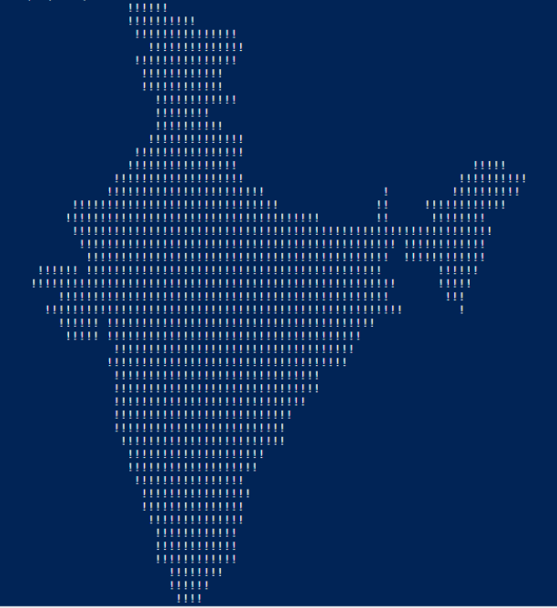

# unnecessary-c-scripts
Some wholly unnecessary scripts, written in the C language

### Including

- A script that prints the Indian map

    

- A script highlighting the difference between the `break` and `continue` statements

    
