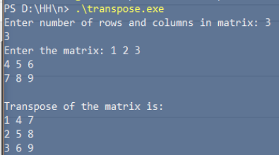

# unnecessary-c-scripts
Some wholly unnecessary scripts, written in the C language

### Including
- [A script that prints the Indian map](graphic_map/map.c)

    

- [Interactive bubblesort implementation](bubblesort/bubblesort.c)

    

- [Interactive linear search implementation](linearsearch/linearsearch.c)

    

- [A script for transposing matrices](transposition/transpose.c)

    
    
- [A script for multiplying two matrices](matrix_multiplication/matrixmult.c)

    

- [A script to create pyramids](pyramid/pyramid.c)

    

- [A couple of simple factorial algorithms (no caching/memoisation)](./factorial/)
    - [Using a simple `for` loop](./factorial/nfactorial-for.c)
    - [Using recursion](./factorial/factorial.c)
    
        

- [A naive algorithm to print the first n fibonacci numbers](fibonacci/fibonacci.c)

      

- [A script to explore basic string manipulations](string_basics/stringfns.c)

    

- [A script to check if a string is a palindrome (case sensitive)](./palindrome/palindrome.c)

    

- [A script highlighting the difference between the `break` and `continue` statements](breakcontdiff/breakcontdiff.c)

    
