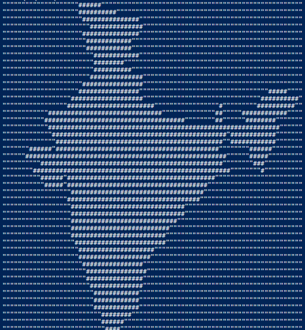

# unnecessary-c-scripts
Some wholly unnecessary scripts, written in the C language

### Including

- [Interactive bubblesort implementation](bubblesort/bubblesort.c)

    

- [A script for multiplying matrices](matrix_multiplication/matrixmult.c)

    

- [A script highlighting the difference between the `break` and `continue` statements](breakcontdiff/breakcontdiff.c)

    

- [A script that prints the Indian map](graphic_map/map.c)

    
